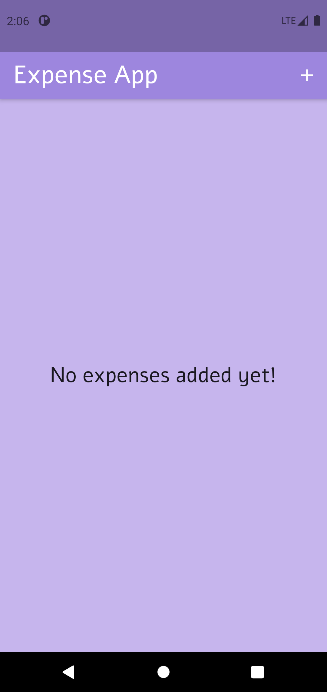
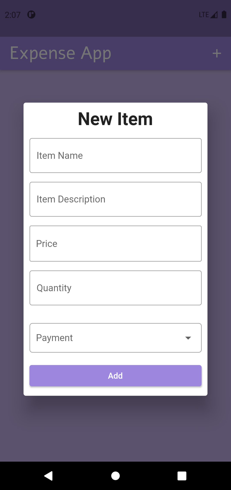
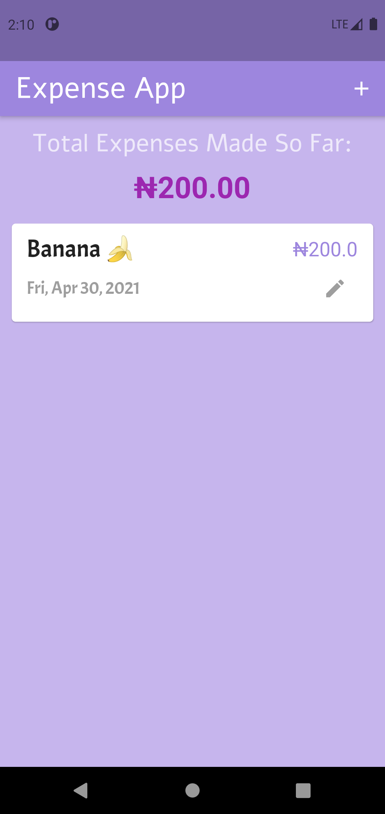
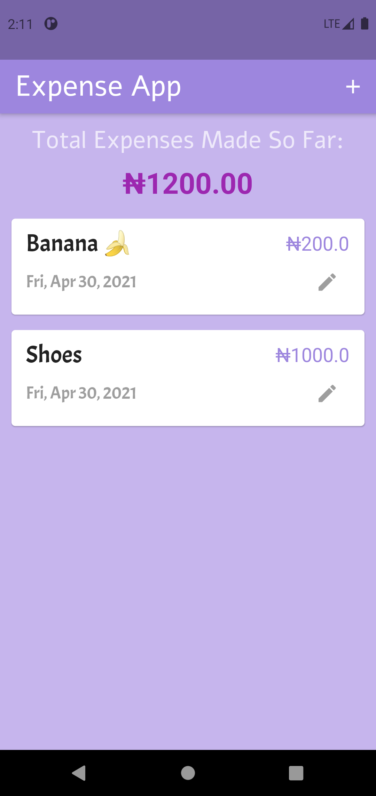
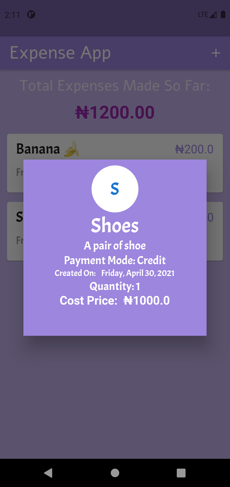
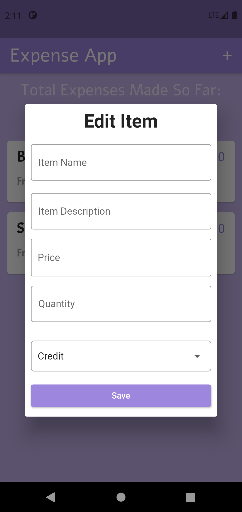
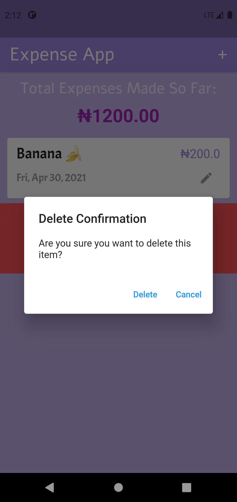
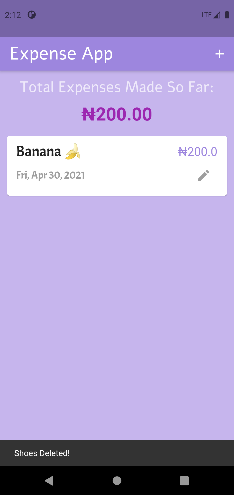
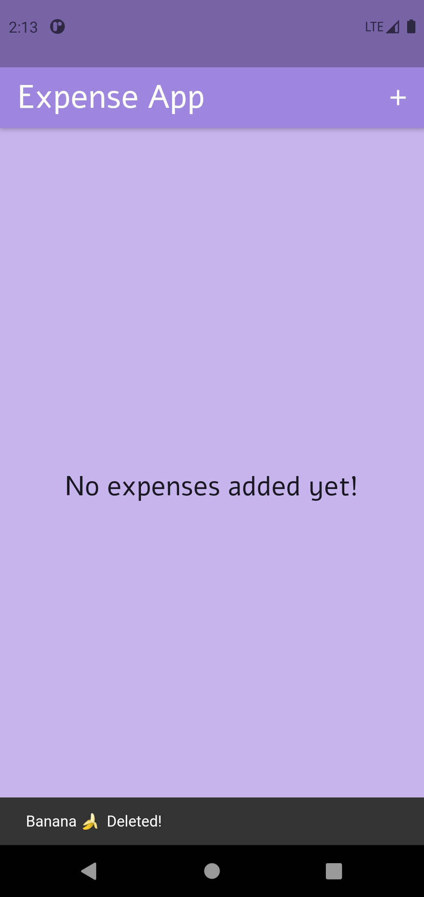

# Family Expense

In a standard home, a number of expenditures are done daily, this app helps in tracking such expenditure.

## Hint

This flutter application project uses HIVE for data persistence

Download apk with the link below:

- [APK](https://drive.google.com/file/d/1IPeIAlFWPSS9udqBH_iyvelc3MxVp3B5/view?usp=sharing)

# Screenshots:

<!-- This below pattern of adding images is wrong because it cannot be resized -->
<!-- 
 -->

## Enjoy!!!
